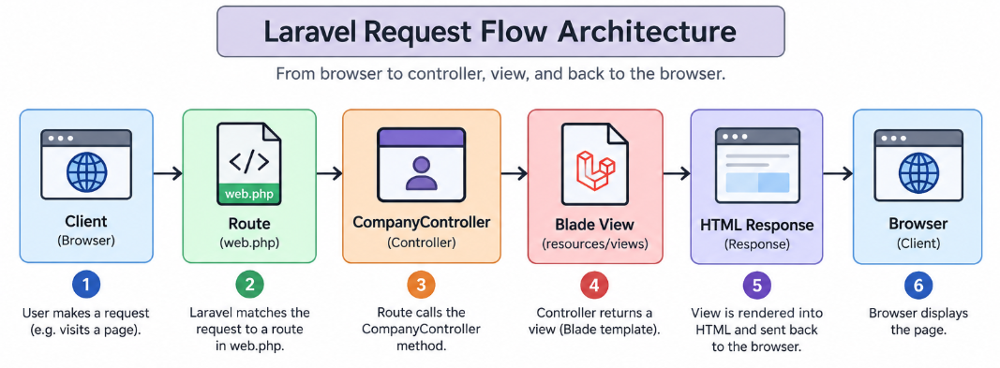

**AI Usage Disclaimer:** Please note that Google's Gemini AI was utilized during the writing of this document strictly as an editorial tool. Its use was limited to refining sentence structure and applying Markdown formatting. The actual project execution, troubleshooting, and underlying ideas presented here were mixed of personal knowledge and AI-supported ideas.

# ITST 302 - Client-Server Technologies: Company Profile Website

## 1. Project Title

**Company Profile Website**

A Laravel-based company profile website designed to present a company's information, services, and contact details in a simple and organized way.

## 2. Introduction

### What is a Company Profile Website?

A company profile website is a website that introduces a business to people online. It usually contains information such as the company's background, services, contact information, and other details that help visitors understand what the company does.

### Why Businesses Need One

Businesses need a company profile website because many people look for information online before contacting or working with a company. A website gives the business a professional online presence and makes important information easier to find.

### Purpose of the Project

The purpose of this project is to create a simple and functional company profile website using **Laravel**. The project demonstrates how Laravel's MVC structure, routing, controllers, and Blade templates can be used to organize a website.

## 3. Objectives

The following objectives were accomplished:

- Create a functional company profile website using Laravel.
- Create Home, About, Services, and Contact pages.
- Use Laravel routes to connect URLs to the appropriate pages.
- Use a controller to manage page requests.
- Use Blade templates to create reusable layouts and components.
- Create reusable navigation and footer components.
- Organize the project using Laravel's folder structure.
- Improve the website layout and UI through testing and revisions.
- Make the website easier to navigate.

## 4. MVC Architecture

### What is MVC?

MVC stands for **Model-View-Controller**. It is a software architecture that separates an application into different parts.

- **Model** – Handles data and data-related logic.
- **View** – Handles what the user sees.
- **Controller** – Handles requests and connects the application's logic with the view.

In this project, the main focus is on the **Controller** and **View** because the website mainly presents company information.

### Why Laravel Uses MVC

Laravel uses MVC because it makes a project easier to organize. Instead of putting all the code in one place, different responsibilities are placed in different files and folders.

For example, a route receives a request, a controller decides what should happen, and a Blade view displays the result.

### Advantages of MVC

- **Better organization** – Each part has a specific responsibility.
- **Easier maintenance** – Changes can be made to one part without unnecessarily affecting other parts.
- **Code reuse** – Views and components can be reused.
- **Easier teamwork** – Developers can work on different parts.
- **Easier debugging** – Problems are easier to locate.

### Laravel Request Flow

```text
Browser
   │
   ▼
Route (web.php)
   │
   ▼
CompanyController
   │
   ▼
Blade View
   │
   ▼
HTML Response
   │
   ▼
Browser
```

### Architecture Diagram

The architecture diagram is saved as:

`documentation/laravel-request-flow-architecture.png`



## 5. Laravel Routing

### What is Routing?

Routing is the process of deciding what should happen when a user visits a specific URL. Laravel web routes are commonly defined in `routes/web.php`.

Example:

```php
Route::get('/about', [CompanyController::class, 'about'])
    ->name('about');
```

When the user visits `/about`, Laravel matches the URL and calls the `about` method in `CompanyController`.

### Named Routes

A named route gives a route a specific name that can be used when creating links.

```php
Route::get('/about', [CompanyController::class, 'about'])
    ->name('about');
```

The route can then be referenced using:

```php
route('about')
```

Named routes are useful because links do not have to depend directly on the URL.

### GET Requests

A GET request is commonly used when a user wants to access or view a page.

```php
Route::get('/', [CompanyController::class, 'home'])
    ->name('home');
```

### Route Definitions

Example routes for this project:

```php
use App\Http\Controllers\CompanyController;

Route::get('/', [CompanyController::class, 'home'])->name('home');
Route::get('/about', [CompanyController::class, 'about'])->name('about');
Route::get('/services', [CompanyController::class, 'services'])->name('services');
Route::get('/contact', [CompanyController::class, 'contact'])->name('contact');
```


## 6. Controllers

### Purpose of Controllers

A controller handles requests from the routes and decides what response should be returned.

In this project, `CompanyController` handles requests for the company profile pages.

Location:

`app/Http/Controllers/CompanyController.php`

### Benefits of Controllers

- Organize page-related logic.
- Keep routes easier to read.
- Make the application easier to maintain.
- Group related functions together.
- Keep the project organized.

### Controller Methods

A controller method is a function that handles a particular request.

```php
public function home()
{
    return view('pages.home');
}

public function about()
{
    return view('pages.about');
}

public function services()
{
    return view('pages.services');
}

public function contact()
{
    return view('pages.contact');
}
```

For example, when `/about` is accessed, Laravel calls `about()` and returns the About Blade view.

## 7. Blade Templating Engine

Blade is Laravel's templating engine. It allows developers to create HTML pages while using Laravel's template features. Blade files normally use the `.blade.php` extension.

### Blade Layouts

A Blade layout is a reusable page structure. It can contain common elements such as the navigation bar, content area, and footer.

```php
<!DOCTYPE html>
<html>
<head>
    <title>@yield('title')</title>
</head>

<body>
    @include('components.navbar')

    <main>
        @yield('content')
    </main>

    @include('components.footer')
</body>
</html>
```

### Blade Components

This project contains reusable components such as:

- `navbar.blade.php`
- `footer.blade.php`
- `layout.blade.php`

These help keep the website consistent.

### `@extends`

`@extends` allows a page to use an existing Blade layout.

```php
@extends('components.layout')
```

### `@section`

`@section` defines content that will be placed inside a layout section.

```php
@section('title', 'About Us')

@section('content')
    <h1>About Our Company</h1>
    <p>Learn more about our company.</p>
@endsection
```

### `@yield`

`@yield` creates a location in the layout where page-specific content appears.

```php
<title>@yield('title')</title>
```

### `@include`

`@include` inserts another Blade file into the current view.

```php
@include('components.navbar')
```

### Example Blade Page

```php
@extends('components.layout')

@section('title', 'Home')

@section('content')
    <h1>Welcome to Our Company</h1>
    <p>We provide quality services for our customers.</p>
@endsection
```

## 8. Laravel Folder Structure

### `app/`

Contains the main application code. The project controller is inside:

```text
app/
└── Http/
    └── Controllers/
        └── CompanyController.php
```

### `routes/`

Contains route definitions. The main web routes are in:

```text
routes/
└── web.php
```

### `resources/`

Contains resources used to build the interface. The project's Blade views are in:

```text
resources/
└── views/
    ├── components/
    │   ├── footer.blade.php
    │   ├── layout.blade.php
    │   └── navbar.blade.php
    └── pages/
        ├── about.blade.php
        ├── contact.blade.php
        ├── home.blade.php
        └── services.blade.php
```

### `public/`

Contains files that can be accessed publicly by the browser, including public assets.

### `bootstrap/`

Contains files that help initialize the Laravel framework and application.

### `config/`

Contains configuration files for the Laravel application and its services.

### Simplified Project Structure

```text
project/
├── app/
│   └── Http/
│       └── Controllers/
│           └── CompanyController.php
├── bootstrap/
├── config/
├── public/
├── resources/
│   └── views/
│       ├── components/
│       │   ├── footer.blade.php
│       │   ├── layout.blade.php
│       │   └── navbar.blade.php
│       └── pages/
│           ├── about.blade.php
│           ├── contact.blade.php
│           ├── home.blade.php
│           └── services.blade.php
└── routes/
    └── web.php
```

## 9. Screenshots

Add the following screenshots to the documentation:

| Screenshot | Suggested File |
|---|---|
| Home Page | `screenshots/home-page.png` |
| About Page | `screenshots/about-page.png` |
| Services Page | `screenshots/services-page.png` |
| Contact Page | `screenshots/contact-page.png` |
| Navigation Bar | `screenshots/navbar.png` |
| Footer | `screenshots/footer.png` |


## 10. Problems Encountered

### 1. Difficulty in Layouting Each Page

One of the main challenges I experienced was creating the layout for each page. It was sometimes difficult to decide where to place sections, buttons, images, and other elements. I wanted the pages to look organized and consistent with each other.

### 2. UI and Component Accuracy

Another problem was making sure the UI of the pages and reusable components looked accurate. Sometimes spacing, alignment, sizing, and positioning did not look the way I originally planned.

### 3. Making Pages Consistent

It was challenging to make the navigation bar, footer, spacing, and overall design consistent across all pages. A small change in one part of the layout could sometimes affect another section.

### 4. Finding a Good Design Direction

It was also difficult to decide how the website should look. I needed references to understand how modern company profile websites organize their content and sections.

## 11. Solutions

### Solution to Layout Problems

I solved the layout problems by testing the pages repeatedly in the browser. I adjusted spacing, sizes, positioning, and sections until the pages looked more organized.

I also used reusable Blade layouts and components so common elements did not need to be recreated on every page.

### Solution to UI Accuracy Problems

For UI accuracy, I used **Gemini AI** to help check and improve the design of some UI elements and components. It helped me understand how certain elements could be positioned and styled more accurately.

I still checked the results myself because AI suggestions were not always exactly what I wanted.

### Solution to Design Consistency

I used the Blade layout, navbar, and footer as reusable parts of the website. This helped keep the pages consistent and reduced repeated code.

### Solution to Finding Design Ideas

I used **Dribbble** as a reference for layout ideas. I looked at different website designs to get ideas for arranging sections, cards, buttons, and other UI elements. The references were used for inspiration rather than directly copying another website's design.

## 12. Reflection

Working on this Laravel project helped me understand how MVC works in a more practical way. Before working with Laravel, I mostly thought of a website as a collection of pages. While developing this project, I learned that a web application can be separated into different parts so that each part has a clear responsibility. This made the project easier to understand and organize.

I learned that MVC stands for Model, View, and Controller. The Model is responsible for data and data-related logic, the View is responsible for what the user sees, and the Controller handles requests and connects the different parts of the application. Even though this project mainly focused on controllers and views, I was able to see how the MVC concept can be used to structure a larger application.

I also learned why separation of concerns is important. If all of the routes, HTML, and application logic were placed in one file, the project would quickly become difficult to manage. By separating the routes, controllers, and views, I can find and change a specific part of the application more easily. For example, if I want to change the appearance of a page, I can work on its Blade view without having to change the route.

The relationship between routes, controllers, and views also became clearer to me. When a user visits a URL, Laravel checks the route in `web.php`. The route can then call a method from `CompanyController`. The controller decides which Blade view should be returned. Finally, Laravel renders the Blade view into HTML and sends the response back to the browser. This process helped me understand what happens behind the scenes when a user opens a page.

One of the biggest challenges I experienced was designing the layout and making the UI accurate. Sometimes the spacing, positioning, or appearance of components did not look the way I expected. I used Gemini AI to help improve some UI details and used Dribbble for design references and layout ideas. However, I still had to test and adjust the results myself.

Overall, this project gave me a better understanding of how Laravel can be used to build organized web applications. I believe the same architecture can be useful for larger enterprise systems because different teams can work on different parts of the application. With proper organization, MVC can make a large system easier to maintain, update, test, and expand.

## 13. References

Laravel. (n.d.). *Laravel documentation*. Laravel.

Mozilla Developer Network. (n.d.). *MDN Web Docs*. Mozilla.

PHP Documentation Group. (n.d.). *PHP manual*. PHP.net.

Tailwind Labs. (n.d.). *Tailwind CSS documentation*. Tailwind CSS.

Dribbble. (n.d.). *Dribbble: Discover the world's top designers and creative professionals*. Dribbble.

## Appendix: Project Architecture Diagram


